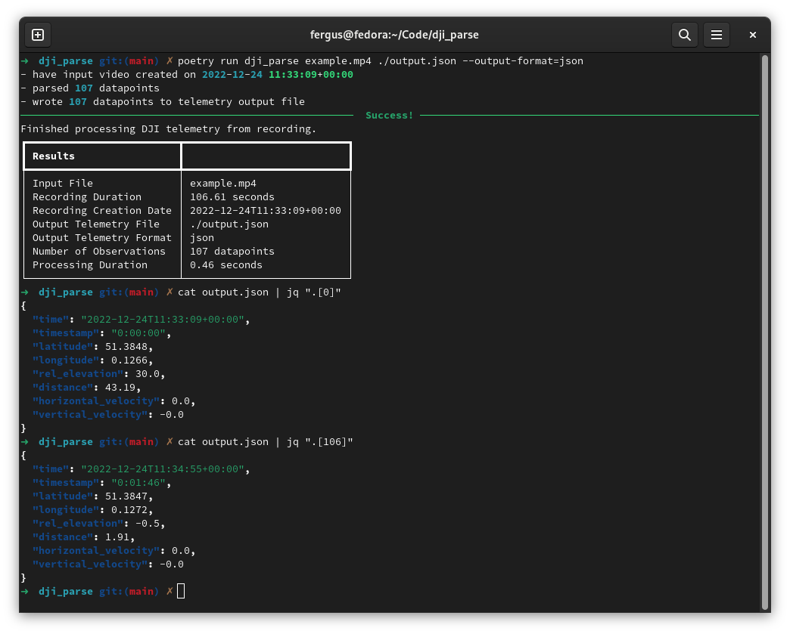

# dji_parse 

A simple utility for parsing telemetry data from MP4 recordings generated by DJI drones - such as the DJI Mini 2. Output data can be stored as either CSV, JSON, or GPX data.

<p style="text-align:center">
    
</p>

## Requirements

1. Python 3.11 or above.
2. Poetry for Python dependency management.
3. `ffmpeg` installed locally on your system.
4. Recordings from a DJI Drone with subtitle telemetry enabled.

## Usage

```
➜  dji_parse git:(main) ✗ poetry run dji_parse --help
Usage: dji_parse [OPTIONS] INPUT_VIDEO OUTPUT

  Parse INPUT_VIDEO file for embedded DJI telemetry, writing data to OUTPUT.

  Supports writing telemetry data in either CSV, JSON, or GPX format. Defaults
  to GPX.

Options:
  --output-format [csv|gpx|json]
  --help                          Show this message and exit.
```

### Output

Telemetry samples include:

1. A timestamp computed by adding the sample timestamp (see (2)) to the video's creation date. (`string` in ISO format)
2. A relative timestamp. (`HH:MM:SS`)
3. A Latitude and Longitude pair. (`float`)
4. Relative Elevation. (`float` in unit `meters`)
5. Distance. (`float` in unit `meters`)
6. Horizontal and Vertical Velocities. (`float` in unit `meters/secs`)

From the samples I've parsed it appears that the telemetry subtitles are generated at a sample-rate of 1Hz - i.e. they provide a single observation per second - with GPS precision of 4 decimal places. 

Better values are available from the `FlightRecord` binary logs, however the format isn't documented and there are issues with the DJI supplied SDK/parser.

#### Example: CSV

```text
time,timestamp,latitude,longitude,rel_elevation,distance,horizontal_velocity,vertical_velocity
...
2022-12-24T11:34:55+00:00,00:01:46,51.3847,0.1272,-0.5,1.91,0.0,-0.0
```

#### Example: GPX

```xml
<?xml version="1.0" encoding="UTF-8"?>
<gpx xmlns="http://www.topografix.com/GPX/1/1" xmlns:xsi="http://www.w3.org/2001/XMLSchema-instance" xsi:schemaLocation="http://www.topografix.com/GPX/1/1 http://www.topografix.com/GPX/1/1/gpx.xsd" version="1.1" creator="gpx.py -- https://github.com/tkrajina/gpxpy">
  <trk>
    <trkseg>
      <!-- ... -->  
      <trkpt lat="51.3847" lon="0.1272">
        <ele>-0.5</ele>
        <time>2022-12-24T11:34:55Z</time>
      </trkpt>
    </trkseg>
  </trk>
</gpx>
```

#### Example: JSON

```json
[
  {
    "time": "2022-12-24T11:34:55+00:00",
    "timestamp": "00:01:46",
    "latitude": 51.3847,
    "longitude": 0.1272,
    "rel_elevation": -0.5,
    "distance": 1.91,
    "horizontal_velocity": 0.0,
    "vertical_velocity": -0.0
  }
]
```

## Thanks

This wouldn't have been possible without [ewpratten/dji3d](https://github.com/ewpratten/dji3d) - and if you're looking to 3D plots from the extracted data then it's probably the better option!

Before seeing @ewpratten's `dji3d` repository I was trying to parse the subtitles out manually - which meant a lot of MP4 file format headaches.

## License

This project is made available under the terms of the [The MIT License](https://opensource.org/licenses/MIT).